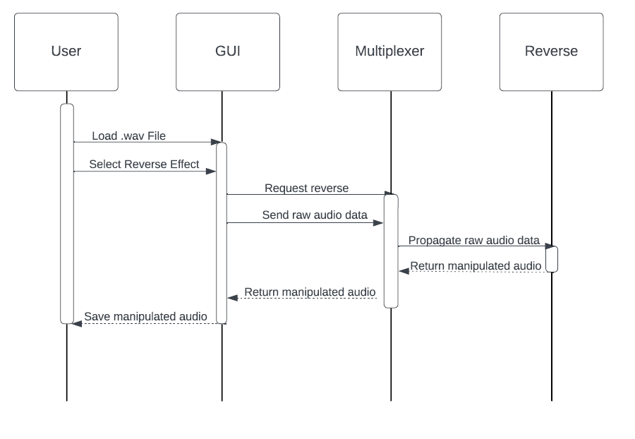

# WaveTech-Audio-Editor
An audio editor for .wav files.

## Features
Load a local .wav file and perform the following operations:
1. Pitch Shift +-12 semitones
2. Time Stretch 50-200%
3. Reverse Audio

## Dependencies
The following libraries are required for this project to work:
### [AudioFile](https://github.com/adamstark/AudioFile) by [AdamStark](https://github.com/adamstark)
The AudioFile library is used to extract, edit, and save raw audio data to/from a .wav file.
### [asio](https://think-async.com/Asio/) by [Christopher M. Kohlhoff](https://github.com/chriskohlhoff)
Asio (Asynchronous I/O) is used for communication between WaveTech's GUI and signal processor.

## Build Instructions
1. Clone this repository.
2. Navigate to the `WaveTech-Audio-Editor/build` directory.
3. Run `cmake --build .'

## Communication Contract
The following methods are used to programmatically send and receive data between services.
### Sending/Receiving Strings
The following lines can be used to send and receive string messages.
- ```pipe_object->send_message(std::string);```
- ```std::string = pipe_object->recv_message();```
### Sending/Receiving Audio Data
- ```pipe_object->send_audio(AudioFile<float>::AudioBuffer*);```
- ```AudioFile<float>::AudioBuffer* buf = pipe_object->recv_audio();```
### Send/Recv Interactions
